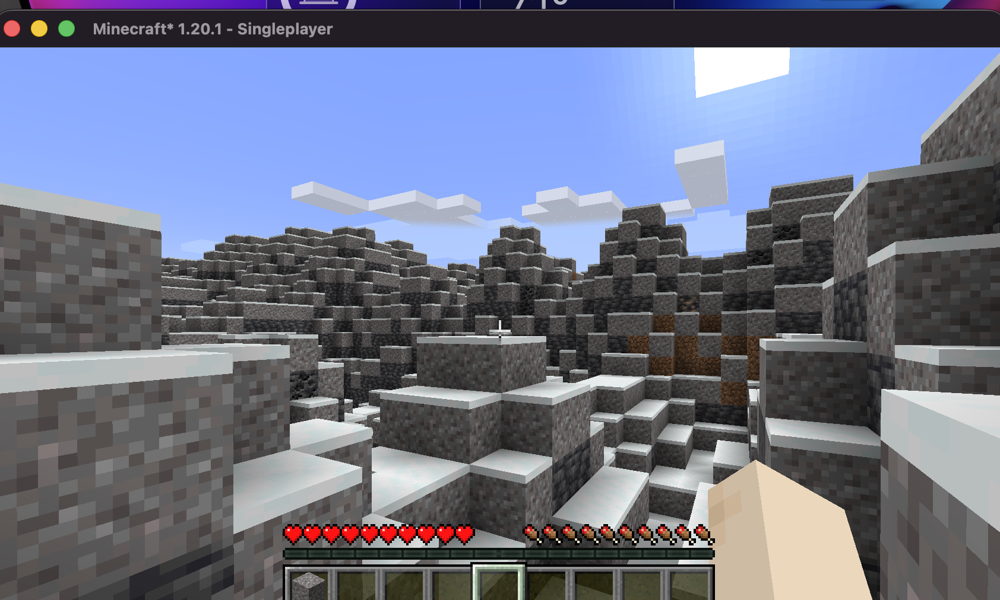

# Mc-Imagine
> Describe a world. Play in it.




## Overview
Mc-Imagine is a two-part system that revolutionizes Minecraft world generation by allowing you to prompt a world into existence using AI. The project consists of:
1. **A Minecraft Mod**: Built with Architectury for Fabric and Forge (1.20.1). It loads AI models natively to generate terrain, biomes, and structures based on a text prompt.
2. **A Python Training Pipeline**: An end-to-end pipeline used to train and produce the ONNX models consumed by the mod.

## Features
- **Prompt-Driven Generation**: Type a prompt, and the AI will shape the world around it.
- **Fully Local & Offline**: All generation happens on your machine. No cloud dependencies, no APIs.
- **Plug-and-Play Models**: Easily swap between different `.mcim` model files to change the style and capabilities of generation.
- **Hardware Agnostic**: Supports both CPU and GPU execution for broad compatibility.
- **Deterministic Seeds**: The same prompt and seed will always generate the exact same world.
- **Structure Control**: Models are capable of guiding structure placement alongside terrain.

## Quick Start
### For Players
1. **Install the Mod**: Download the appropriate `.jar` (Fabric or Forge) for Minecraft 1.20.1 from the releases page.
2. **Download a Model**: Get a `.mcim` model file.
3. **Drop in Folder**: Place the `.mcim` file in your `mcimagine/models` directory (relative to the game's run directory, e.g. `.minecraft/mcimagine/models` for the vanilla launcher, or `mod/fabric/run/mcimagine/models` when running from source).
4. **Create a World**: Launch the game, select the "Mc-Imagine" world type, enter your prompt, and start playing!

### For Developers
#### Prerequisites
- JDK 17
- Python 3.11+
- Gradle

#### Building from Source
**Mod:**
```bash
cd mod
./gradlew build
```
**Python Pipeline Setup:**
```bash
python -m venv .venv
source .venv/bin/activate
pip install -e model/
```

`pip install -e model/` is required — it installs the pinned dependencies *and* puts
`mc_imagine_model` on the import path, which every `python -m mc_imagine_model.…` command needs.
On an NVIDIA box, install the CUDA-matched torch wheel as well; see
**[docs/TRAINING.md](docs/TRAINING.md)** for the complete clone → train → export → play walkthrough.

#### Project Structure
- `mod/` - Architectury Minecraft mod source code
- `model/` - Python training pipeline (`model/src/mc_imagine_model/`: data, model, training, export) for producing `.mcim` models
- `docs/` - Technical documentation

## Roadmap
- **Phase 0**: Architecture planning and foundation.
- **Phase 1**: Pipeline creation and minimal model training.
- **Phase 2**: Mod loader integration and ONNX runtime setup.
- **Phase 3**: World generation hooks and chunk generation.
- **Phase 4**: Advanced generation (biomes, structures).
- **Phase 5**: Polish, optimization, and public release.

## Contributing
Contributions are welcome! Please read our [Contributing Guide](docs/contributing.md) for details on our code of conduct and the process for submitting pull requests.

## License
This project is licensed under the GNU General Public License v3.0 - see the [LICENSE](LICENSE) file for details.
