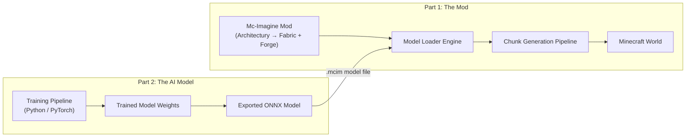
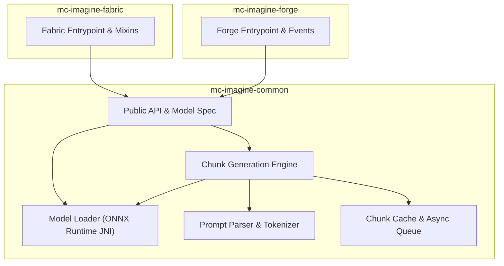
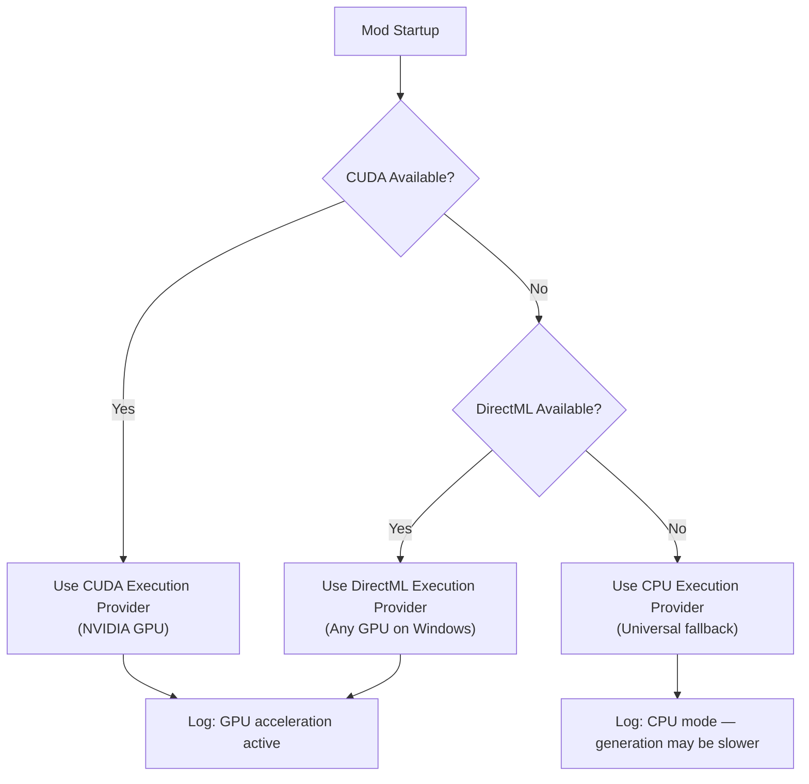
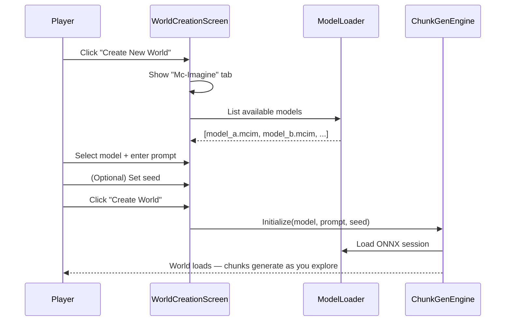
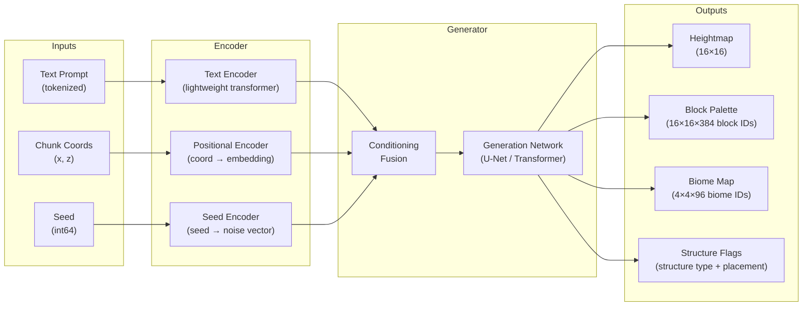
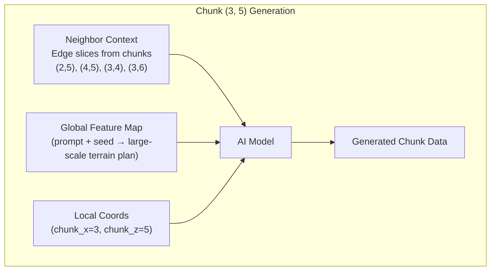

# Mc-Imagine — Project Outline

> **AI-Powered World Generation for Minecraft**
> *"Describe a world. Play in it."*

---

## 1. Vision & Overview

Mc-Imagine is a two-part open-source system that replaces Minecraft's built-in procedural world generation with AI-driven, prompt-based generation. Instead of selecting a seed and hoping for the best, players describe the world they want in natural language — *"Towering mesa plateaus with winding river canyons, scattered desert temples, no villages"* — and the AI generates it in real-time as chunks load.

### Core Principles

| Principle | Description |
|---|---|
| **Fully Local** | No internet connection, no API calls, no cloud dependency. The AI model runs entirely on the player's machine. |
| **Plug & Play** | The mod is a *model loader*, not a model. Players download AI model files separately and drop them into a folder. The mod handles the rest. |
| **Real-Time Streaming** | Worlds generate on-the-fly, chunk by chunk, exactly like vanilla Minecraft. No pre-generation step, no loading screens. |
| **Open Ecosystem** | A published model format spec lets anyone — individuals, teams, research groups — create and distribute compatible models. |

### The Two-Part Architecture



**Part 1 — The Mod** is a Minecraft Java Edition mod (1.20.x, Architectury for Fabric + Forge support) that:
- Provides a world-creation UI for selecting a model and entering a prompt
- Loads AI models at runtime via ONNX Runtime
- Intercepts Minecraft's chunk generation pipeline
- Feeds prompts to the model and converts output into playable chunks

**Part 2 — The AI Model** is a separately developed and distributed neural network that:
- Takes a text prompt + chunk coordinates + seed as input
- Outputs structured chunk data (heightmaps, block palettes, biome assignments, structure placement)
- Is trained on extracted Minecraft world data
- Is exported to ONNX format for cross-platform inference

---

## 2. Technical Architecture

### 2.1 The Mod (Java / Kotlin — Architectury)

#### Mod Loader & Platform Support

| Detail | Choice |
|---|---|
| **Minecraft Version** | 1.20.x (1.20.1 initially — largest modded community) |
| **Mod Loaders** | Fabric + Forge via [Architectury](https://architectury.dev/) |
| **Language** | Java 17 (Architectury standard), Kotlin optional for utilities |
| **Build System** | Gradle (Architectury Loom) |

#### Module Breakdown



**`mc-imagine-common`** — Platform-agnostic core (all business logic lives here):

- **Model Loader** — Discovers `.mcim` model files in the `models/` directory, validates them against the model spec, initializes ONNX Runtime sessions. Supports hot-swapping models without restarting the game.
- **Chunk Generation Engine** — Replaces vanilla's `ChunkGenerator`. Receives chunk coordinate requests from Minecraft's world-loading system, dispatches them to the AI model, and assembles the output into valid `ChunkAccess` / `ProtoChunk` objects.
- **Prompt Parser** — Preprocesses the user's natural language prompt into the tokenized format the model expects. Handles structure blacklisting/whitelisting (e.g., parsing "no villages" into structured constraint flags).
- **Chunk Cache & Async Queue** — Ensures chunk generation happens off the main thread. Uses a priority queue (distance from player = priority) and a configurable cache (LRU) to avoid regenerating already-visited chunks.
- **Public API** — Exposes interfaces for other mods to interact with Mc-Imagine (e.g., register custom structure types, query the active model, listen to generation events).

**`mc-imagine-fabric`** / **`mc-imagine-forge`** — Thin platform-specific layers:

- Mod entrypoints, registration hooks
- Mixins (Fabric) or event hooks (Forge) to intercept `ChunkGenerator` selection
- Platform-specific UI integration (world creation screen modifications)

#### Inference Runtime: ONNX Runtime

> [!IMPORTANT]
> **Why ONNX Runtime over alternatives?**
>
> | Option | Pros | Cons |
> |---|---|---|
> | **ONNX Runtime** ✅ | Cross-platform, C++ core with Java JNI bindings, GPU (CUDA/DirectML) + CPU, mature ecosystem, wide model format support | Adds ~50-100 MB native dependency |
> | llama.cpp subprocess | Great for LLMs, highly optimized | Wrong tool — designed for autoregressive text, not structured output. Subprocess IPC adds latency. |
> | Embedded Python/PyTorch | Maximum flexibility | Enormous dependency (~2 GB), JVM↔Python bridge is fragile, startup overhead |
> | Custom C++ inference | Minimal footprint | Massive engineering effort, reinventing the wheel |
>
> ONNX Runtime is the clear winner: it's designed for exactly this use case (fast structured inference with hardware acceleration), has first-party Java bindings (`com.microsoft.onnxruntime:onnxruntime`), and supports GPU acceleration via CUDA (NVIDIA) and DirectML (AMD/Intel on Windows) with automatic CPU fallback.

**Hardware Acceleration Strategy:**



#### World Creation UI Flow



The world creation screen gets a new **"Mc-Imagine"** tab/panel (injected via Mixin) with:
1. **Model selector** — Dropdown listing all `.mcim` files found in `.minecraft/mc-imagine/models/`
2. **Prompt text field** — Multi-line text input for the world description
3. **Seed field** — Optional, for reproducibility. If blank, a random seed is generated.
4. **Model info card** — Shows the selected model's metadata (name, version, author, description, supported features)
5. **Generate preview** (stretch goal) — Small thumbnail preview of what the terrain might look like

---

### 2.2 The AI Model (Python — PyTorch → ONNX)

#### Model Architecture Concept

The AI model is a neural network that maps **(prompt, chunk_x, chunk_z, seed)** → **chunk data**. This is fundamentally a *conditional generation* task: given a text condition (the prompt) and spatial coordinates, produce a structured 3D output.



#### Model Output: What a Single Inference Produces

Each model inference generates data for **one chunk** (16×16 blocks, full world height). The output is a structured tensor bundle:

| Output | Shape | Description |
|---|---|---|
| **Heightmap** | `(16, 16)` | Surface height at each (x, z) position |
| **Block Volume** | `(16, 384, 16)` | Block ID at each (x, y, z) — full height range |
| **Biome Grid** | `(4, 96, 4)` | Biome ID per 4×4×4 section (matches MC's biome resolution) |
| **Structure Markers** | `(N, 5)` | List of (structure_type, x, y, z, rotation) for structure placement |
| **Cave Mask** | `(16, 384, 16)` | Binary mask for carving out caves/caverns (or baked into block volume) |

> [!NOTE]
> The block volume is the most expensive output. A single chunk is 16 × 384 × 16 = **98,304 block positions**. The model doesn't need to predict every single block — it can predict a *compressed* representation (e.g., run-length encoded columns, palette + index, or a low-res volume upsampled by rules). Compression strategy is a key research area for the model.

#### Coherence Across Chunks

The hardest problem: adjacent chunks must look coherent. A mountain can't abruptly end at a chunk boundary.

**Approach: Coordinate Conditioning + Overlap Context**

- The model receives **global coordinates** (chunk_x, chunk_z) as input, not just relative chunk-local positions. Combined with the seed, this gives the model a deterministic "view" of where this chunk sits in the world.
- During training, the model sees chunks in spatial context (adjacent chunk data as conditioning input). At inference time, already-generated neighbor chunk edge data (16×384×1 slices) is fed as additional context.
- A **global feature map** derived from the prompt + seed provides consistent large-scale terrain planning (e.g., "there's a mountain range running NE→SW") without needing to generate the whole world upfront.



#### Training Data

The model is trained on **extracted chunk data from existing Minecraft worlds**:

1. **World Generation** — Generate thousands of vanilla Minecraft worlds with diverse seeds using MC's built-in generator (headless server, automated).
2. **Chunk Extraction** — For each world, extract chunk data (block volumes, biomes, heightmaps, structure locations) into a standardized format.
3. **Labeling** — Each world/region gets text descriptions (initially manual, later potentially automated with a vision model analyzing rendered screenshots). Labels describe terrain features, biome types, structure presence, etc.
4. **Augmentation** — Rotations, reflections, and prompt paraphrasing to increase dataset diversity.

> [!TIP]
> A significant portion of training data can be auto-generated: run vanilla worldgen with known seeds, then use heuristics to auto-label (e.g., "this region is 80% desert biome with mesa nearby" → "desert landscape bordering mesa formations"). Manual labeling is needed primarily for subjective/aesthetic descriptions.

#### Training Pipeline

```
┌─────────────────────────────────────────────────────────┐
│  Training Pipeline (Python / PyTorch)                   │
│                                                         │
│  1. World Generator Script (headless MC server)         │
│     └─→ Raw world saves (.mca region files)             │
│  2. Chunk Extractor (Python, anvil-parser/amulet)       │
│     └─→ Structured chunk tensors (.npz / .h5)           │
│  3. Labeling Pipeline (heuristic + manual)              │
│     └─→ (chunk_data, text_label) pairs                  │
│  4. Training Loop (PyTorch, multi-GPU)                  │
│     └─→ Model checkpoints (.pt)                         │
│  5. ONNX Export (torch.onnx.export)                     │
│     └─→ Deployable model (.onnx)                        │
│  6. Packaging (ONNX + metadata → .mcim)                 │
│     └─→ Distributable model file (.mcim)                │
└─────────────────────────────────────────────────────────┘
```

#### Model Size & Performance Targets

| Tier | Parameters | Disk Size | Target Inference (GPU) | Target Inference (CPU) | Quality |
|---|---|---|---|---|---|
| **Lite** | ~10M | ~40 MB | <10ms/chunk | <50ms/chunk | Basic terrain coherence, limited prompt understanding |
| **Standard** | ~50M | ~200 MB | <25ms/chunk | <150ms/chunk | Good terrain variety, reliable prompt following |
| **Pro** | ~200M | ~800 MB | <50ms/chunk | <500ms/chunk | Rich detail, nuanced prompt interpretation, structure awareness |

> [!IMPORTANT]
> These are aspirational targets. Actual performance depends heavily on model architecture research. The key constraint is: **chunk generation must be faster than the player can walk to new chunks**. At normal walking speed, a player crosses ~1 chunk every 3.5 seconds, and Minecraft pre-generates in a radius, so the model has some breathing room — but generation should target <100ms/chunk on a mid-range gaming PC to feel seamless.

---

### 2.3 The Model File Format (`.mcim`)

The `.mcim` (Minecraft Imagine Model) format is a ZIP archive containing:

```
example-model-v1.mcim (ZIP archive)
├── model.onnx              # The ONNX model weights
├── tokenizer.json          # Prompt tokenizer vocabulary and config
├── manifest.json           # Model metadata (see below)
└── preview.png             # Optional: thumbnail preview image
```

**`manifest.json` spec:**

```json
{
  "format_version": 1,
  "model": {
    "name": "ImagineBase",
    "version": "1.0.0",
    "author": "Mc-Imagine Team",
    "description": "General-purpose world generation model with terrain, biome, and structure support.",
    "license": "GPL-3.0"
  },
  "capabilities": {
    "terrain": true,
    "biomes": true,
    "caves": true,
    "structures": ["village", "temple", "mineshaft", "stronghold", "ruined_portal"],
    "block_palette": true,
    "max_prompt_tokens": 256
  },
  "requirements": {
    "min_ram_mb": 512,
    "recommended_vram_mb": 2048,
    "onnx_opset": 17
  },
  "io": {
    "input_names": ["prompt_tokens", "chunk_x", "chunk_z", "seed", "neighbor_context"],
    "output_names": ["heightmap", "block_volume", "biome_grid", "structure_markers"]
  }
}
```

> [!TIP]
> The `.mcim` format spec is designed to be **versioned and extensible**. Third-party model creators only need to follow this spec — they can use any training framework, any architecture, as long as the exported ONNX model conforms to the declared I/O contract. This is the foundation of the plug-and-play ecosystem.

---

## 3. Project Structure (Repository Layout)

The project is a **monorepo** with clear separation between the mod and the model:

```
Mc-Imagine/
├── README.md
├── LICENSE                          # GPLv3
├── docs/
│   ├── project-outline.md           # This document
│   ├── model-spec.md                # .mcim format specification
│   ├── contributing.md
│   └── architecture/
│       ├── mod-architecture.md
│       └── model-architecture.md
│
├── mod/                             # Part 1: The Minecraft Mod
│   ├── build.gradle
│   ├── settings.gradle
│   ├── gradle.properties
│   ├── common/                      # Architectury common module
│   │   └── src/main/java/com/mcimagine/
│   │       ├── McImagine.java       # Mod entrypoint
│   │       ├── api/                 # Public API interfaces
│   │       ├── model/               # Model loading & ONNX integration
│   │       ├── generation/          # Chunk generation engine
│   │       ├── prompt/              # Prompt parsing & tokenization
│   │       ├── cache/               # Chunk caching & async queue
│   │       ├── ui/                  # World creation screen modifications
│   │       └── config/              # Mod configuration
│   ├── fabric/                      # Fabric-specific code
│   │   └── src/main/java/com/mcimagine/fabric/
│   └── forge/                       # Forge-specific code
│       └── src/main/java/com/mcimagine/forge/
│
├── model/                           # Part 2: The AI Model
│   ├── pyproject.toml               # Python project config
│   ├── requirements.txt
│   ├── src/
│   │   ├── data/                    # Data extraction & preprocessing
│   │   │   ├── world_generator.py   # Headless MC world generation
│   │   │   ├── chunk_extractor.py   # .mca → tensor extraction
│   │   │   ├── labeler.py           # Auto-labeling heuristics
│   │   │   └── dataset.py           # PyTorch Dataset class
│   │   ├── model/                   # Model architecture
│   │   │   ├── imagine_net.py       # Core model definition
│   │   │   ├── text_encoder.py      # Prompt encoding
│   │   │   ├── positional.py        # Coordinate encoding
│   │   │   └── heads.py             # Output heads (terrain, biome, etc.)
│   │   ├── training/                # Training scripts
│   │   │   ├── train.py
│   │   │   ├── config.cuda.yaml
│   │   │   ├── config.mps.yaml
│   │   │   └── losses.py            # Custom loss functions
│   │   └── export/                  # ONNX export & .mcim packaging
│   │       ├── export_onnx.py
│   │       └── package_mcim.py
│   ├── notebooks/                   # Research & experimentation
│   └── tests/
│
├── tools/                           # Shared utilities
│   ├── model-validator/             # CLI tool to validate .mcim files
│   └── chunk-visualizer/            # Debug tool to render chunks
│
└── .github/
    ├── workflows/
    │   ├── mod-build.yml            # CI: Build mod for Fabric + Forge
    │   ├── model-test.yml           # CI: Run model unit tests
    │   └── release.yml              # CD: Build & publish releases
    └── ISSUE_TEMPLATE/
```

---

## 4. Development Phases

### Phase 0: Foundation (Weeks 1–3)

> **Goal:** Skeleton project that compiles and runs on both Fabric and Forge with a placeholder world generator.

- [ ] Set up Architectury project (Gradle, Loom, multi-module)
- [ ] Create mod entrypoint, verify it loads on Fabric 1.20.1 and Forge 1.20.1
- [ ] Implement a **dummy `ChunkGenerator`** that generates flat worlds or simple noise terrain (no AI yet)
- [ ] Add Mixin/hook to inject the custom `ChunkGenerator` as a selectable world type
- [ ] Modify the world creation screen to add a "Mc-Imagine" world type option
- [ ] Set up CI pipeline (GitHub Actions: build on push, test on PR)
- [ ] Write project README, contributing guide, and license

**Deliverable:** A mod that creates a simple custom world type (e.g., sine-wave terrain) selectable from the world creation screen.

---

### Phase 1: Model Loader & ONNX Integration (Weeks 4–7)

> **Goal:** The mod can load a `.mcim` file, run inference, and use the output (even if the model is trivial).

- [ ] Integrate ONNX Runtime Java bindings into the Gradle build (platform-specific native libs for Windows/macOS/Linux)
- [ ] Define the `.mcim` file format and `manifest.json` schema
- [ ] Implement `ModelLoader`: scan `models/` directory, parse manifests, validate models
- [ ] Implement `ModelSession`: load ONNX model, run inference with test inputs
- [ ] GPU detection and execution provider selection (CUDA → DirectML → CPU fallback)
- [ ] Build a **trivial test model** in Python (e.g., a model that just outputs flat terrain at a height determined by prompt length) and export to ONNX
- [ ] Wire model inference into the custom `ChunkGenerator` — model output → chunk blocks
- [ ] Add model selector dropdown to the world creation screen

**Deliverable:** The mod loads a `.mcim` file, runs it through ONNX Runtime, and generates (trivial) terrain from model output.

---

### Phase 2: Prompt System & World Creation UX (Weeks 8–10)

> **Goal:** Full world creation workflow — select model, type prompt, set seed, create world.

- [ ] Implement prompt tokenizer (aligned with model training tokenizer)
- [ ] Add multi-line prompt text field to world creation screen
- [ ] Add optional seed input field
- [ ] Implement prompt preprocessing: extract structure blacklist/whitelist from natural language (regex + keyword matching initially, model-assisted later)
- [ ] Build the prompt → model input tensor pipeline
- [ ] Implement seed → deterministic noise vector mapping
- [ ] World metadata: save prompt + model + seed in world save data (for sharing/reproducibility)
- [ ] Config screen: model directory path, GPU preference, cache size, logging level

**Deliverable:** Complete world creation UX. Player can type a prompt, pick a model, and create a world (terrain quality depends on model).

---

### Phase 3: Async Generation & Performance (Weeks 11–14)

> **Goal:** Chunk generation is async, performant, and doesn't cause frame drops.

- [ ] Move all model inference off the main thread into a dedicated generation thread pool
- [ ] Implement priority queue: chunks closest to the player generate first
- [ ] Implement LRU chunk cache (configurable size) to avoid re-inference for visited areas
- [ ] Neighbor context system: pass edge block data from adjacent generated chunks to the model
- [ ] Chunk generation budgeting: limit inference time per game tick to prevent frame drops
- [ ] Performance profiling and optimization (batch inference if model supports it)
- [ ] Loading indicators: show generation progress in debug screen (F3)
- [ ] Graceful degradation: if generation can't keep up, extend render distance of already-generated chunks and show placeholder chunks (stone/void) at far distances

**Deliverable:** Smooth gameplay experience — chunks generate in the background without frame drops, even on CPU-only systems.

---

### Phase 4: The Real AI Model (Weeks 15–30+)

> **Goal:** Train a model that actually produces interesting, prompt-responsive terrain.

This phase is parallel to mod development and is the core research effort:

- [ ] **Data Pipeline**
  - [ ] Script to launch headless MC servers and generate worlds with varied seeds
  - [ ] Chunk extractor: read `.mca` region files → structured tensors
  - [ ] Auto-labeling pipeline: analyze chunks and generate text descriptions
  - [ ] Dataset class with efficient loading, augmentation, and batching

- [ ] **Model Research & Iteration**
  - [ ] Prototype architecture (likely a conditional U-Net or vision transformer)
  - [ ] Start with 2D terrain (heightmap-only) before moving to full 3D block volumes
  - [ ] Add biome prediction head
  - [ ] Add structure placement head
  - [ ] Experiment with block volume compression (palette prediction + index grid vs. raw block IDs)
  - [ ] Cross-chunk coherence: train with neighbor context, evaluate boundary smoothness

- [ ] **Training Infrastructure**
  - [ ] Training script with config management (Hydra or similar)
  - [ ] Logging and visualization (TensorBoard / W&B)
  - [ ] Multi-GPU training support (PyTorch DDP)
  - [ ] Checkpoint management and model versioning

- [ ] **Export & Validation**
  - [ ] ONNX export script with shape verification
  - [ ] `.mcim` packaging script
  - [ ] End-to-end test: export model → load in mod → generate world → verify no errors
  - [ ] Quality benchmarks: FID-like metric for terrain realism, prompt adherence scoring

**Deliverable:** A working AI model that generates coherent, prompt-responsive Minecraft terrain in the `.mcim` format.

---

### Phase 5: Polish & First Release (Weeks 31–36)

> **Goal:** Public alpha release with one bundled model.

- [ ] End-to-end testing across Fabric and Forge
- [ ] Cross-platform testing (Windows, macOS, Linux)
- [ ] GPU and CPU testing on varied hardware
- [ ] Documentation: user guide, model creator guide, API docs
- [ ] Model spec documentation (for third-party model creators)
- [ ] `.mcim` validator CLI tool
- [ ] Chunk visualizer debug tool
- [ ] CurseForge / Modrinth mod listing
- [ ] Model hosting (GitHub Releases, or a simple download page)
- [ ] First public release 🎉

---

## 5. Prompt-Driven Structure Control

A key differentiator of Mc-Imagine is the ability to control **structure placement** via natural language:

### How It Works

The prompt parser extracts structure intent from the user's description:

| User Prompt Fragment | Parsed Intent |
|---|---|
| *"Tall hills with scattered villages"* | `villages: FREQUENT` |
| *"Deep ocean, no structures"* | `all_structures: DISABLED` |
| *"Dense forest with hidden temples"* | `temples: FREQUENT, villages: DISABLED (implied by "hidden")` |
| *"NO villages"* | `villages: DISABLED` |
| *"Desert with pyramids everywhere"* | `desert_pyramid: VERY_FREQUENT` |

The model receives these as **structure control flags** — a vector of per-structure-type weights (0.0 = never, 1.0 = normal, 2.0+ = increased frequency). The model learns to respect these during training.

### User-Defined Structures (Future)

> [!NOTE]
> For v1, the model only handles vanilla Minecraft structures (villages, temples, mineshafts, strongholds, etc.). User-defined custom structures (e.g., "place my castle blueprint at mountain peaks") is a compelling future feature that would require:
> - A structure blueprint format (NBT schematic input)
> - Model conditioning on blueprint data
> - Or a hybrid approach: AI generates terrain, a post-processing step places user schematics at AI-suggested locations

---

## 6. Future Goals & Roadmap

### Multiplayer / Server Support

> [!IMPORTANT]
> **This is explicitly scoped out of the initial release.** The first version is single-player, fully local. Here's the path to multiplayer:

**Why it's achievable:**
- The mod already saves prompt + model + seed in world metadata
- If the model is deterministic (same inputs → same outputs), all clients can independently generate identical chunks — **no server-side generation needed**
- The server just needs to verify that all clients are using the same model version + prompt + seed

**Implementation path:**
1. **Phase A:** Server distributes the model file, prompt, and seed to connecting clients. Each client generates chunks locally. (Requires all clients to have the mod + sufficient hardware.)
2. **Phase B:** Server-side generation for clients that can't run the model. Server generates chunks and sends them like vanilla.
3. **Phase C:** Hybrid — server pre-generates a region around spawn, clients generate frontier chunks locally.

### Community Model Ecosystem

The `.mcim` format spec enables a community ecosystem:

- **Model Hub** — A website or repository where creators publish models (think HuggingFace for Minecraft worlds)
- **Specialized Models** — Fantasy terrain, sci-fi landscapes, historical recreations, specific biome experts
- **Model Competitions** — Community events to create the best model for specific prompt categories
- **Fine-Tuning Toolkit** — Tools for users to fine-tune existing models on their own world saves ("I want worlds that look like *my* favorite server")

### Advanced Features (Post-1.0)

| Feature | Description |
|---|---|
| **Live Prompt Editing** | Change the prompt mid-game; new chunks generate with the updated description. Already-generated chunks persist. |
| **Regional Prompts** | Different prompts for different regions (e.g., "north is tundra, south is tropical") via a world-painting UI. |
| **Structure Blueprints** | Import NBT schematics and tell the model to place them ("castles on hilltops"). |
| **Terrain Preview** | 2D top-down preview of the world before committing to generation. |
| **Model Blending** | Use two models simultaneously (e.g., one for terrain, another for structures). |
| **Bedrock Edition Port** | Port the mod concept to Bedrock via add-on system (significant architectural differences). |

---

## 7. Technical Risks & Mitigations

| Risk | Impact | Likelihood | Mitigation |
|---|---|---|---|
| **Model too slow for real-time generation** | Unplayable frame drops | Medium | Aggressive async queue, chunk caching, model size tiers, batch inference, LOD system |
| **Cross-chunk incoherence** | Ugly terrain seams at chunk borders | High | Neighbor context conditioning, global feature maps, post-processing smoothing pass |
| **ONNX Runtime native lib distribution** | Complex cross-platform packaging | Medium | Platform-specific mod JARs, or a first-run download step for native libs |
| **Training data quality/quantity** | Model produces boring/broken terrain | Medium | Automated world generation pipeline, community labeling efforts, start with simpler output (heightmap-only) |
| **Prompt understanding** | Model ignores or misinterprets prompts | Medium | Start with keyword-based conditioning before full NLP, use established text encoder architectures |
| **Minecraft version updates** | Breaking changes to worldgen internals | Low-Medium | Architectury abstractions, Mixin-based hooks targeting stable interfaces, version-specific adapters |
| **Model file size** | Large downloads for players | Low | Size-tiered models, delta updates, compression |

---

## 8. Technology Stack Summary

| Component | Technology |
|---|---|
| **Mod Language** | Java 17 |
| **Mod Framework** | Architectury (Fabric + Forge) |
| **Minecraft Version** | 1.20.1 |
| **Build System** | Gradle (Architectury Loom) |
| **Inference Runtime** | ONNX Runtime (Java JNI bindings) |
| **GPU Acceleration** | CUDA (NVIDIA) / DirectML (AMD/Intel) / CPU fallback |
| **Model Training** | Python 3.11+, PyTorch 2.x |
| **Model Export** | ONNX (opset 17+) |
| **Model Format** | `.mcim` (custom ZIP archive) |
| **Data Extraction** | Python (anvil-parser / Amulet) |
| **CI/CD** | GitHub Actions |
| **License** | GPLv3 |
| **Version Control** | Git (GitHub) |

---

## 9. Success Criteria (v1.0 Alpha)

- [ ] Mod installs and runs on Fabric 1.20.1 and Forge 1.20.1
- [ ] At least one `.mcim` model available for download
- [ ] Player can: select model → enter prompt → create world → explore seamlessly
- [ ] Chunk generation does not cause noticeable frame drops on a mid-range gaming PC (GTX 1060 / RX 580 tier)
- [ ] Same prompt + same seed + same model = same world (deterministic)
- [ ] Model responds meaningfully to at least 20 distinct prompt keywords/phrases
- [ ] Terrain is visually coherent across chunk boundaries (no jarring seams)
- [ ] Works on Windows, macOS, and Linux
- [ ] Documentation sufficient for a third party to create a compatible `.mcim` model
